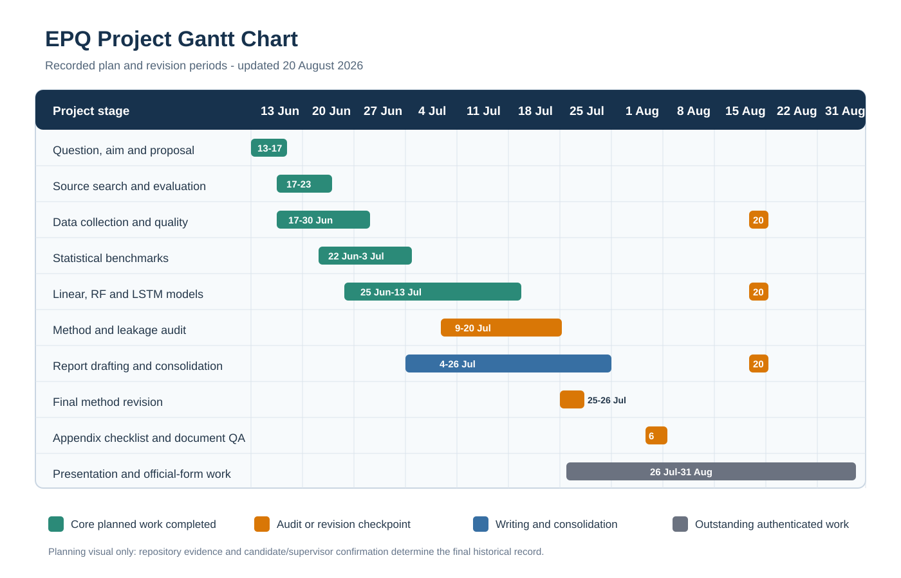
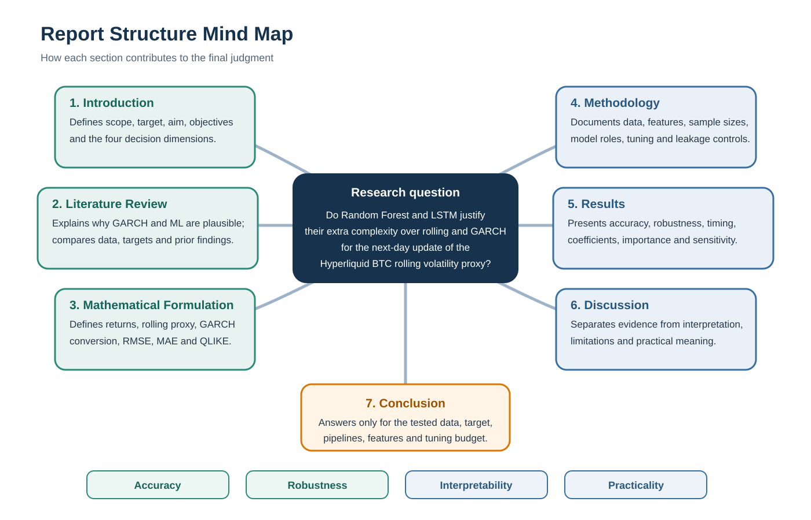

# EPQ Appendix Pack

This pack brings the six main appendix items into one order. It points to the
maintained evidence files and includes the key visuals and summary tables.

## 1. Detailed Time Table

| Stage | Planned period | What and why | Evidence or status |
| ---: | --- | --- | --- |
| 1 | 13-17 Jun | Define a narrow question before choosing sources or methods | Proposal history and PL-05/PL-06 |
| 2 | 17-23 Jun | Build and evaluate the research base | Sources, literature notes, search log and evaluation files |
| 3 | 17-30 Jun | Collect checked market data and build the first common dataset | Raw/processed data, metadata and quality report |
| 4 | 22 Jun-13 Jul | Implement benchmarks and the three supervised comparators | Model package, configurations and outputs |
| 5 | 1-20 Jul | Compare, audit, correct and rerun the experiment | Dated predictions, automated tests and robustness outputs |
| 6 | 4-26 Jul | Draft the report, revise the question and strengthen the method and evaluation | English/Chinese reports and PL-11.07 |
| 7 | 6 Aug | Complete Appendix checklist and document-layout QA | This pack, PL-11.08 and rebuilt bilingual DOCX files |
| 8 | 26 Jul-31 Aug | Rehearse, present and complete authenticated records | Preparation exists; real delivery and signatures remain outstanding |
| 9 | 20 Aug | Refresh completed candles and rerun the frozen-cutoff experiment | 1,271 completed candles through 19 Aug; 950 training and 276 test rows; all overall ranks retained |

The full phase-by-phase timetable, including limitations on historical date
authentication, is in `appendix/timetable.md`.

## 2. Gantt Chart

The chart visualises recorded plans and revisions. It is not independent proof
that every task was completed on its target date.

## 3. Source Evaluation

| Source | Use in this EPQ | Important limitation or design difference |
| --- | --- | --- |
| Hansen and Lunde (2005) | Treats GARCH(1,1) as a serious benchmark | Exchange-rate/equity evidence, not cryptocurrency or this proxy |
| Dudek et al. (2024) | Shows rankings vary by asset, horizon and metric | Uses richer intraday realised variance |
| Huang, Sangiorgi and Urquhart (2024) | Prevents a universal anti-neural-network conclusion | High-frequency inputs and more advanced architectures |
| Shen, Wan and Leatham (2021) | Motivates high-volatility regime checks | Different target, recurrent model and validation design |
| Patton (2011) | Motivates supplementary variance-scale QLIKE | Assumptions do not make this overlapping proxy latent volatility |
| Breiman (2001); Hochreiter and Schmidhuber (1997) | Justify RF and LSTM model inclusion | Foundational papers do not validate this implementation or dataset |

The complete reconciled evaluation is in
`research/source-evaluation-summary.md`; the original workbook remains at
`research/Source_Evaluation_Tianlin_He.xlsx`.

## 4. Mind Map for Report Structure

## 5. Risk Assessment

| Risk | Likelihood | Impact | Mitigation |
| --- | --- | --- | --- |
| Scope becomes too broad | Medium | High | Focus on one BTC perpetual-futures market and one next-day proxy update |
| Open or malformed candles enter modelling | Low after controls | High | Require completed timestamps, strict cadence, valid OHLC and positive prices |
| Time-series leakage or date misalignment | Low after controls | High | Use a fixed chronological cutoff, date-keyed forecasts and regression tests |
| GARCH target conversion is implemented incorrectly | Low after controls | High | Derive the conversion, test the recursion and retain an analytic sensitivity |
| RF/LSTM tuning uses the final test | Low after controls | High | Select only on the chronological tail of training data and export selection tables |
| Pipelines are mistaken for an architecture-only experiment | Medium | High | Disclose features, sample sizes and transformations; bound the conclusion |
| The proxy is treated as true latent volatility | Medium | Medium | State the 29-return overlap, add QLIKE and retain proxy limitations |
| One history is treated as universal evidence | Medium | Medium | Use windows, halves, folds, regimes, refresh and block bootstrap; limit claims |
| AI-supported work is disclosed inaccurately | Medium | High | Require a candidate-specific disclosure and keep unauthenticated fields blank |

The maintained full register is in `appendix/risk-assessment.md`.

## 6. Data Charts

| Rank | Model | RMSE | QLIKE |
| ---: | --- | ---: | ---: |
| 1 | GARCH(1,1) | 0.00098301 | 0.00445845 |
| 2 | Lagged linear regression | 0.00137492 | 0.00724584 |
| 3 | Rolling historical volatility | 0.00139570 | 0.00754794 |
| 4 | LSTM | 0.00168735 | 0.00897661 |
| 5 | Random Forest | 0.00211129 | 0.01182354 |

The chart must be read in light of the overlapping target. On the final 19
August shock target, Random Forest had the smallest one-day error, but all five
models underpredicted the jump and Random Forest remained fifth overall. Full
tables and robustness outputs are indexed in
`appendix/model-results-summary.md` and stored under `code/outputs/`.
