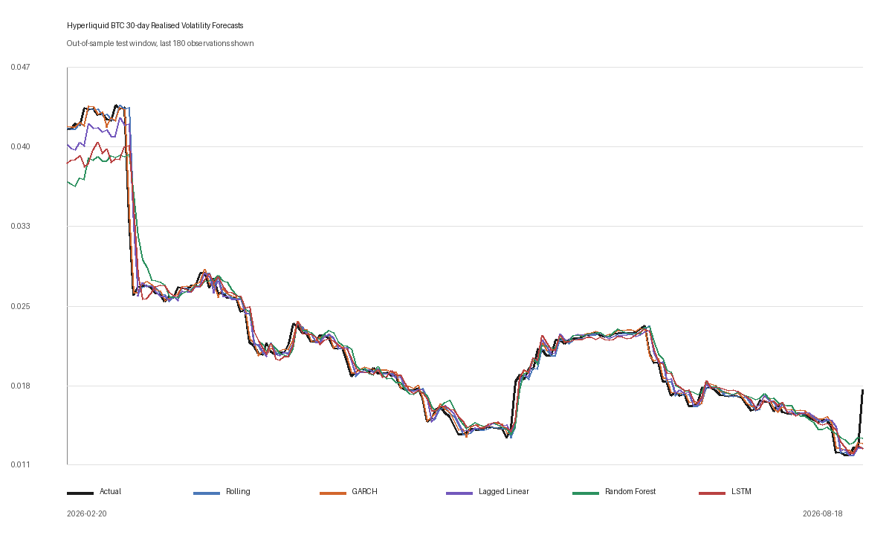

# Do Random Forest and LSTM Justify Their Additional Complexity? Forecasting the Next-Day Update of a Hyperliquid BTC Perpetual-Futures Volatility Proxy

## Abstract

This project compares rolling volatility, GARCH(1,1), lagged linear regression, Random Forest and Long Short-Term Memory (LSTM) for forecasting the next update of a daily Bitcoin volatility proxy. The data are completed Hyperliquid BTC perpetual-futures candles. The main target is the next day's updated 30-day standard deviation of daily log returns. Adjacent targets share 29 returns, so this is an update forecast rather than a forecast of a completely new 30-day period. The main test uses a fixed chronological split, followed by checks with a 14-day target, different time periods, volatility groups, expanding windows, a block bootstrap and a fixed-cutoff data refresh. The models are compared using RMSE, MAE and QLIKE, together with ease of explanation and practical cost.

GARCH(1,1) has the lowest RMSE (`0.00098301`) and QLIKE (`0.00445845`). Its RMSE is 29.569% below rolling, and it ranks first in every additional check. Neither machine-learning model beats rolling overall. Under this design, Random Forest and LSTM do not improve the forecast enough to justify their extra complexity. This conclusion applies only to the data, target, inputs and model settings used here.

## 1. Introduction

Volatility describes the scale of variation in returns rather than the direction of price movement. A price-direction forecast asks whether Bitcoin will rise or fall; a volatility forecast asks how uncertain or variable the next period may be. Traders and risk managers can use such an estimate when setting position sizes, risk limits or collateral buffers even when they do not know the next return's sign. Cryptocurrency is useful for this investigation because sharp movements and persistent market stress make changing uncertainty visible, while public exchange data make an independent comparison reproducible.

The research question is:

> To what extent do Random Forest and LSTM justify their additional complexity over rolling historical volatility and GARCH(1,1) when forecasting the next-day update of a volatility proxy constructed from Hyperliquid BTC perpetual-futures returns?

The aim is to determine whether the additional complexity of Random Forest and LSTM over rolling historical volatility and GARCH(1,1) is justified when forecasting this next-day update. The objectives are to:

1. construct a reproducible 14- and 30-day rolling standard-deviation proxy from completed Hyperliquid BTC perpetual-futures candles;
2. implement rolling historical volatility, GARCH(1,1), lagged linear regression, scikit-learn Random Forest and LSTM without test leakage;
3. compare forecast accuracy using RMSE, MAE and QLIKE;
4. test robustness across target windows, chronological periods, volatility regimes, resampling, rolling-origin refits and a fixed-cutoff refresh;
5. compare interpretability and practicality using produced explanations, dependency and tuning burden, structural size and local fit/predict time; and
6. judge whether any machine-learning gain is sufficiently large and stable to justify added complexity.

The models are judged by accuracy, stability, ease of explanation and practical cost. The method must also be reproducible. Machine learning can represent nonlinear relationships and sequences, but it also adds overfitting risk and more choices. A complex method should therefore show a clear accuracy gain that remains in later checks.

Lagged linear regression is auxiliary rather than a fifth answer to the research question: it tests whether engineered features help without a nonlinear learner. Rolling is the persistence benchmark; GARCH is the conditional-variance benchmark; Random Forest is a nonlinear tabular learner; and LSTM is a nonlinear sequence learner. Their results compare complete forecasting pipelines, not isolated architectures. The asset is specifically Hyperliquid BTC perpetual futures, not a generic Bitcoin spot index, limiting generalisation to other venues and spot markets.

The evaluation date is fixed rather than recalculated as a moving 80/20 boundary after each download. 16 November 2025 remains the first forecast-origin date in the primary test whenever new completed candles are appended. This matters because otherwise a refresh would move several observations from test into training, changing both the evidence and the question. Applying the same final code to archives ending 19 July and 19 August 2026 tests whether 31 newly completed days change the result under the same historical cutoff.

## 2. Literature review

### 2.1 Why GARCH remains a serious benchmark

Financial return variance is not usually constant through time. Large movements often cluster together, as do calm periods. Bollerslev (1986) developed Generalised Autoregressive Conditional Heteroskedasticity so that conditional variance could depend on recent squared shocks and earlier conditional variance. GARCH(1,1) is therefore designed around persistence rather than being a generic regression applied to a time series.

Hansen and Lunde (2005) demonstrate why GARCH(1,1) should not be treated as a weak benchmark. They compare 330 ARCH-type models out of sample. For exchange-rate data they find no evidence that more sophisticated models outperform GARCH(1,1), although asymmetric models do better for IBM returns. The lesson is conditional: GARCH can be difficult to beat in one setting and inadequate in another. Katsiampa (2017) similarly supports conditional-variance modelling for Bitcoin, finding an autoregressive-component GARCH model strongest among several GARCH-family specifications tested in sample. Neither study establishes that simple GARCH must win this experiment; together they justify treating it as a serious competitor.

### 2.2 Mixed evidence on machine learning

The machine-learning literature does not give one stable ranking. Dudek et al. (2024) compare 12 statistical and machine-learning methods, including GARCH, Random Forest and LSTM, on four cryptocurrencies. Performance varies with asset, loss function and horizon, and simple linear methods can match the more complex learners. Their realised variance is constructed from intraday returns, however, and is richer than the daily rolling proxy used here.

Huang, Sangiorgi and Urquhart (2024) provide a contrasting result. Using high-frequency Bitcoin data from 2014 to 2021, they report neural-network improvements over GARCH across their tested horizons. Their LSTM and CNN-LSTM models receive richer transformations and many more intraday observations, so a small daily-data LSTM is not an equivalent replication. Shen, Wan and Leatham (2021) also find that a recurrent network performs better on average forecasting measures, but less effectively for extreme events and Value at Risk. That distinction supports evaluating high-volatility behaviour rather than relying only on aggregate RMSE.

Zahid, Iqbal and Koutmos (2022) combine GARCH with machine learning, showing that the two are not opposing camps. Catania, Grassi and Ravazzolo (2019) also find model and parameter instability in cryptocurrency forecasting. This supports multiple chronological checks while recognising that one market history is not an independent replication.

### 2.3 Features, sequences and interpretability

Breiman (2001) describes Random Forest as an ensemble of randomised decision trees. Bootstrap sampling and random feature selection reduce dependence among trees, while averaging reduces variance. The method can capture thresholds and interactions without assuming a linear equation. In time-series work, however, it does not know chronological order automatically; past information must be represented through lags and rolling features. Feature design is therefore part of the model, not neutral preprocessing.

Hochreiter and Schmidhuber (1997) introduced LSTM to address the difficulty recurrent neural networks face when learning longer dependencies. Its gates control what information is retained, updated and exposed. That architecture appears suitable for persistent volatility, but suitability is not proof of accuracy. Sequence length, hidden size, scaling, learning rate, regularisation and stopping all matter, especially with only about one thousand training observations.

Interpretability must also be defined carefully. Lundberg and Lee (2017) show how attribution methods can explain parts of complex predictions, while Molnar (2025) stresses that different tools answer different questions. This project credits only evidence actually produced: equations and parameters for GARCH; signed standardised coefficients for linear regression; impurity and permutation importance plus out-of-bag (OOB) diagnostics for Random Forest; and architecture, losses, seed stability and post-hoc input-ablation sensitivity for LSTM. Importance and ablation are associational, can be distorted by correlated inputs and do not explain one forecast causally.

### 2.4 Volatility is measured through a proxy

True conditional volatility is latent. Patton (2011) shows that rankings can depend on the imperfect proxy and loss function used to compare forecasts. This motivates reporting QLIKE as a supplementary loss on squared proxy and forecast values. High-frequency realised variance is often more informative than a rolling standard deviation based on one daily close; QLIKE improves the evaluation but cannot remove the present proxy's limitations. The target is therefore a *daily volatility proxy*, not Bitcoin's latent true volatility.

The proxy has an important structural property: 29 of the 30 returns in tomorrow's primary window are already known today. Persistence is therefore partly mathematical as well as empirical. Rolling volatility is a demanding operational benchmark, and a model must estimate the effect of the entering return and the leaving return more accurately to beat it. This design is appropriate for an updated one-day-ahead risk indicator, but it is different from predicting a wholly future, non-overlapping 30-day window.

Overall, GARCH has a strong basis, machine learning can outperform it with richer data, simple methods can remain competitive, and rankings depend on the market, target and evaluation procedure.

Three expectations follow. Rolling volatility should be difficult to beat because of target overlap. GARCH may benefit if recent shocks help estimate the one unknown entering return. Random Forest and LSTM should help only if their nonlinear or sequential patterns add information beyond persistence. These are expectations to test, not assumptions about which model should win.

## 3. Mathematical formulation

Let $P_t$ be the daily closing price on day $t$. The logarithmic return is

$$
r_t=\ln\left(\frac{P_t}{P_{t-1}}\right).
$$

For a window of $n$ days, the daily realised-volatility proxy is the sample standard deviation

$$
RV_t^{(n)}=\sqrt{\frac{1}{n-1}\sum_{i=t-n+1}^{t}(r_i-\bar r_t)^2}.
$$

The primary window is $n=30$, while $n=14$ is a robustness check. Values are not annualised. A row formed at day $t$ predicts

$$
y_t=RV_{t+1}^{(n)},
$$

and rolling historical volatility sets $\hat y_t=RV_t^{(n)}$.

Feature scaling is fitted only on the relevant training portion:

$$
z_{tj}=\frac{x_{tj}-\mu_{j,\mathrm{train}}}{\sigma_{j,\mathrm{train}}}.
$$

The lagged linear model then solves a lightly regularised objective,

$$
\hat\beta=\arg\min_\beta\sum_{t\in\mathrm{train}}(y_t-z_t^\top\beta)^2+\lambda\lVert\beta\rVert_2^2,
$$

where $\lambda=10^{-8}$ is used for numerical stability rather than strong shrinkage. Random Forest averages $B$ fitted trees,

$$
\hat y_t^{RF}=\frac{1}{B}\sum_{b=1}^{B}T_b(z_t).
$$

For LSTM, input and previous hidden state determine gates such as $f_t=\sigma(W_f[x_t,h_{t-1}]+b_f)$; the cell is updated by $c_t=f_t\odot c_{t-1}+i_t\odot\tilde c_t$, and the final hidden representation is mapped to one volatility estimate. These equations describe information flow, not a direct economic interpretation of each learned weight.

GARCH(1,1) models one-step conditional variance as

$$
h_{t+1}=\omega+\alpha\epsilon_t^2+\beta h_t.
$$

Here $\alpha$ measures shock response and $\beta$ persistence. The final estimates are $\alpha=0.10$, $\beta=0.78$ and $\alpha+\beta=0.88$. The grid search selects $\alpha$ and $\beta$; variance targeting implies $\omega=(1-\alpha-\beta)\hat\sigma_r^2$, so the three reported parameters are not three independently searched quantities.

To map conditional variance to the rolling target, let $S_t$ and $Q_t$ be the sum and sum of squares of the known preceding $n-1$ returns. Under zero conditional mean,

$$
E[s_{t+1}^2\mid\mathcal F_t]=\frac{Q_t+h_{t+1}-(S_t^2+h_{t+1})/n}{n-1}.
$$

Because the target is a standard deviation and squared-error evaluation is used, the primary implementation estimates $E[s\mid\mathcal F_t]$ with deterministic 80-point Gauss-Hermite quadrature. The analytic $\sqrt{E[s^2\mid\mathcal F_t]}$ is retained as a sensitivity because the two expressions are not identical when the square root is concave.

For $m$ test observations,

$$
MAE=\frac1m\sum_{t=1}^{m}|y_t-\hat y_t|, \qquad RMSE=\sqrt{\frac1m\sum_{t=1}^{m}(y_t-\hat y_t)^2}.
$$

RMSE gives more influence to large misses; MAE represents a typical absolute miss. For QLIKE, the standard-deviation proxy is evaluated on the variance scale:

$$
v_t=\max(y_t^2,\varepsilon),\quad \hat v_t=\max(\hat y_t^2,\varepsilon),\quad QLIKE=\frac1m\sum_{t=1}^m\left(\frac{v_t}{\hat v_t}-\ln\frac{v_t}{\hat v_t}-1\right),
$$

where $\varepsilon=10^{-12}$ prevents undefined values and lower is better. QLIKE is a relevant robustness metric for an imperfect proxy (Patton, 2011), but the paper's assumptions do not make this overlapping rolling proxy equivalent to latent conditional variance. Bootstrap replicate $b$ compares each model with rolling using

$$
\Delta_b=RMSE_b(M)-RMSE_b(\mathrm{Rolling}),
$$

so negative values favour the competing model.

## 4. Methodology

### 4.1 Data collection, quality and refresh control

Hyperliquid's public `candleSnapshot` endpoint supplied daily OHLCV candles (Hyperliquid, 2026). Of 1,272 returned rows, the one still-open candle was rejected using its end timestamp. The accepted archive contains 1,271 completed candles from 26 February 2023 through 19 August 2026 (`2026-08-19`).

The quality gate checks schema, chronology, cadence, symbol, interval, prices, OHLC ordering and activity; no critical issue was found. An open candle would change the newest return, proxy and activity fields simultaneously, so completion is enforced. Perpetual futures remain distinct from spot BTC-USD.

The 16 November 2025 cutoff was derived from the original chronological split and then frozen. New candles extend the test end rather than moving its start or becoming training rows. For a same-code comparison, the final pipeline was run on a slice ending 19 July and the current input ending 19 August. The 31 appended days provide a prospective-style stability check within the same market history.

### 4.2 Feature construction and leakage controls

Returns, activity variables, lags and rolling measures use only information observed by origin $t$; the target is shifted to $t+1$ afterwards. Exports retain both origin `date` and predicted `target_date`. Missing warm-up rows are removed before the chronological split.

`realised_volatility_30d` and `rolling_return_std_30d` were the same mathematical feature up to floating-point precision. Retaining both would duplicate persistence, split importance and increase selection probability inside a tree. The matching rolling-standard-deviation column is therefore excluded, leaving 25 tabular inputs and eight LSTM inputs.

The final 30-day frame contains 1,226 rows from 11 April 2023 to 18 August 2026. The fixed training portion contains 950 forecast-origin rows ending 15 November 2025; the test contains 276 origins from 16 November 2025 to 18 August 2026, with target dates through 19 August. No random train-test shuffle is used. Tabular scaling is fitted on training only. LSTM scaling is fitted before its chronological internal-validation block, so validation and test distributions cannot influence the scale parameters.

Effective training counts differ by model even though the cutoff is shared. Linear regression and Random Forest use 950 labelled rows. LSTM uses 921 chronological sequences, divided into 783 fitting sequences and 138 internal-validation sequences. GARCH estimates its return process from 993 pre-cutoff returns, including the warm-up history that cannot form a complete feature row. Rolling has no fitted sample. Reporting these counts avoids implying that structurally different models consume identical observations.

All models use the same cutoff, and no forecast uses later information. Their inputs are not identical. Linear regression and Random Forest use 25 prepared features, LSTM uses eight features in sequences, GARCH uses returns and rolling uses the current proxy. GARCH first forecasts conditional variance and converts it to the rolling target, while the supervised models predict that target directly. The results therefore compare the complete methods as implemented, not model type alone.

### 4.3 Models

**Rolling historical volatility.** The benchmark carries today's rolling proxy forward by one day. It has no fitted parameters and directly exploits the overlap between adjacent windows.

**GARCH(1,1).** A deterministic coarse-to-fine Gaussian maximum-likelihood grid search is combined with variance targeting. The likelihood scores $r_t$ using $h_t$ before $r_t^2$ updates $h_{t+1}$, preventing the current shock from entering its own variance. Parameters remain fixed throughout the primary test, but conditional variance updates when a new return becomes observable. Forecasts are aligned by date, and missing or duplicate mappings cause failure.

**Lagged linear regression.** A linear equation is fitted to standardised inputs with ridge $10^{-8}$. Every coefficient is exported. Coefficients describe association on the standardised scale; correlated lagged measures still prevent causal interpretation.

**Random Forest.** The experimental model is the standard `sklearn.ensemble.RandomForestRegressor`, not a project-local approximation. Six predeclared combinations of maximum depth (`5`, `8`, unrestricted) and minimum leaf size (`5`, `10`) use 300 trees and square-root feature sampling. The last 15% of pre-test rows is a chronological validation block; validation RMSE selects the candidate, with QLIKE only as a tie-break. The selected unrestricted-depth, leaf-size-5 configuration is refitted on all 950 pre-test rows with seed 42. Impurity importance, ten-repeat post-hoc holdout permutation importance and OOB diagnostics are exported.

**LSTM.** Thirty-observation sequences feed one LSTM layer, a 16-unit ReLU layer and one output. Four predeclared hidden-size/learning-rate pairs (`16` or `32`; `0.001` or `0.003`) are compared on the last 15% of training sequences. Chronological validation MSE selects the candidate and controls early stopping; the final test is untouched. The selected model has 32 hidden units, learning rate `0.003`, batch size 32, weight decay `1e-5`, 5,921 trainable parameters and selected epoch 20. Seeds 7, 42 and 101 test optimisation sensitivity. Post-hoc feature ablation replaces one standardised input with its training mean at every sequence step; it is explanatory sensitivity, not another selection stage.

### 4.4 Evaluation and decision rules

The primary result is a fixed-cutoff chronological holdout. Model parameters and weights are not refitted daily, although every method receives information available at the forecast origin. RF and LSTM candidate sets are deliberately compact and comparable in principle rather than equal in size; both use the same training-only chronological-validation rule and never inspect the final holdout. GARCH uses a deterministic likelihood grid, rolling has no selection and linear regression has only a fixed numerical ridge. A supplementary expanding-window design divides the test into four ordered blocks and refits each fitted pipeline at later boundaries.

Robustness also includes 14- and 30-day targets, two chronological test halves, and low-, medium- and high-volatility terciles defined from realised test targets. The regimes are ex-post diagnostic groups, not real-time classifications. A paired circular moving-block bootstrap resamples blocks of 30 days 2,000 times. Thirty days matches the main target's overlap length and helps retain local dependence (Künsch, 1989). Percentile intervals describe uncertainty under this resampling design; they are not universal significance guarantees.

The four comparison areas are reported separately:

| Dimension | Evidence used | Decision rule |
| --- | --- | --- |
| Accuracy | RMSE, MAE and variance-scale QLIKE | RMSE sets the displayed rank; MAE or QLIKE disagreements must be discussed |
| Robustness | Target windows, halves, folds, regimes, refresh and bootstrap | A claimed advantage should not depend on one boundary or a small set of dates |
| Interpretability | Formula, parameters, coefficients, importance or recorded architecture | Only explanations actually produced by the pipeline are credited |
| Practicality | Fit/predict time, dependencies and structural size | Timings are local implementation evidence, not universal speed claims |
| Reproducibility | Fixed dates, seeds, configuration, metadata and tests | Another run should recover the design and explain any data-driven change |

A complex model is justified only if its gain is sufficiently large and stable to compensate for weaker transparency or greater implementation burden.

## 5. Results

### 5.1 Primary 30-day target

| Rank | Model | MAE | RMSE | QLIKE | RMSE vs rolling |
| ---: | --- | ---: | ---: | ---: | ---: |
| 1 | GARCH(1,1) | 0.00048109 | 0.00098301 | 0.00445845 | -29.569% |
| 2 | Lagged linear regression | 0.00072090 | 0.00137492 | 0.00724584 | -1.489% |
| 3 | Rolling historical volatility | 0.00061444 | 0.00139570 | 0.00754794 | 0.000% |
| 4 | LSTM | 0.00099818 | 0.00168735 | 0.00897661 | +20.896% |
| 5 | Random Forest | 0.00123057 | 0.00211129 | 0.01182354 | +51.271% |

GARCH has the lowest MAE, RMSE and QLIKE. QLIKE gives the same complete ordering as RMSE, so the result is not an artefact of using only standard-deviation-scale squared error. Its `-0.00041269` RMSE difference is a 29.569% reduction from rolling.

Linear ranks second by RMSE and QLIKE but has higher MAE than rolling, so its small gain needs uncertainty evidence. LSTM and Random Forest are `+0.00029165` and `+0.00071559` above rolling by RMSE.

After de-duplication, both forest importance methods rank current 30-day volatility, its one-day lag, 30-day mean absolute return and its two-day volatility lag highest, in that order. These are associations, not causes; the forest largely reconstructs persistence more compactly expressed by simpler models.

*Figure 1. Actual next-day rolling-volatility proxies and forecasts over the displayed test interval. The underlying CSV retains every test observation; the chart limits the visible period for legibility.*

Forecasts overlap during persistent stretches and separate most at level changes. Visual inspection is therefore insufficient: RMSE emphasises sharp misses, while MAE, regime bias and resampled differences reveal evidence hidden by the compressed plot.

### 5.2 Target, time and uncertainty robustness

| Target window | GARCH RMSE | Linear RMSE | Rolling RMSE | LSTM RMSE | Random Forest RMSE |
| ---: | ---: | ---: | ---: | ---: | ---: |
| 14 days | 0.00181314 | 0.00258160 | 0.00272309 | 0.00352137 | 0.00383276 |
| 30 days | 0.00098301 | 0.00137492 | 0.00139570 | 0.00168735 | 0.00211129 |

GARCH ranks first at 14 days, 33.416% below rolling. This shorter window has larger errors for every model because each entering or leaving return has greater influence. GARCH also ranks first in both test halves, with RMSE `0.00121469` and `0.00067613`.

| Model | Point RMSE difference vs rolling | 30-day block-bootstrap interval | Resamples favouring model |
| --- | ---: | ---: | ---: |
| GARCH(1,1) | -0.00041269 | [-0.00089954, -0.00016861] | 100.00% |
| Lagged linear regression | -0.00002078 | [-0.00008328, 0.00004204] | 74.80% |
| LSTM | +0.00029165 | [0.00000368, 0.00061163] | 2.30% |
| Random Forest | +0.00071559 | [0.00005958, 0.00128485] | 0.15% |

GARCH's interval remains below zero; linear's crosses zero. Both machine-learning intervals remain above zero: only 2.30% of resamples favour LSTM and 0.15% favour Random Forest. This supports aggregate underperformance rather than a few isolated misses, although resampling one history does not create independent markets.

### 5.3 Rolling origin, regimes and diagnostics

Concatenated fold RMSE is `0.00098432`, `0.00137390`, `0.00139570`, `0.00189862` and `0.00209190` for GARCH, linear, rolling, LSTM and Random Forest. Their QLIKE values are `0.00446344`, `0.00721327`, `0.00754794`, `0.00998982` and `0.01161326`, giving the same ordering.

LSTM is locally competitive only in the first fold, where its RMSE is `0.00082244` and it ranks second, just ahead of linear, Random Forest and rolling. It ranks fourth in folds 2 and 3 and fifth in fold 4, so this one local gain does not establish aggregate stability.

GARCH's low-, medium- and high-regime RMSE values are `0.00069948`, `0.00068656` and `0.00139222`. Its `-0.00013275` high-regime bias indicates slight average underprediction when risk matters most.

Random Forest OOB RMSE is `0.00128268` across all 950 training rows, versus `0.00211129` chronologically, a `0.00082861` gap. OOB trees can train on later training-period rows, so this diagnoses internal prediction rather than time validation and exposes weaker cross-period generalisation.

Seeds 7, 42 and 101 yield LSTM RMSE `0.00178061`, `0.00168735` and `0.00172688`, selecting epochs 11, 20 and 33. The `0.00009326` range shows optimisation variation, but every run remains above rolling's `0.00139570`.

### 5.4 One-month fixed-cutoff refresh

The later refresh appends completed candles while preserving the 16 November 2025 boundary, testing stability without reallocating earlier test observations.

| Model | RMSE through 19 July | RMSE through 19 August | Rank change |
| --- | ---: | ---: | ---: |
| GARCH(1,1) | 0.00098502 | 0.00098301 | 1 → 1 |
| Lagged linear regression | 0.00140087 | 0.00137492 | 2 → 2 |
| Rolling historical volatility | 0.00142744 | 0.00139570 | 3 → 3 |
| LSTM | 0.00174351 | 0.00168735 | 4 → 4 |
| Random Forest | 0.00220594 | 0.00211129 | 5 → 5 |

The added 31 days lower overall RMSE by 0.204% to 4.291% and leave every rank unchanged. QLIKE rises for every model, however, so not every loss measure improves. This remains a procedural stability check within one market history, not an independent replication.

The last target needs to be read separately. BTC closed at 69,323 on 19 August, up from 64,696 on 18 August. The log return was `0.06908`, and the 30-day proxy jumped from `0.0121249` to `0.0174694`. Its forecast origin was 18 August, before that return was observable; all five forecasts were between about `0.0120` and `0.0130`. All five models therefore missed the jump. This one day does not change the full-period ranking, and it would be wrong to tune a revised model on this holdout row and then call the same row independent test evidence.

### 5.5 GARCH conversion sensitivity

| Conversion from conditional variance | MAE | RMSE | QLIKE |
| --- | ---: | ---: | ---: |
| $E[s\mid\mathcal F_t]$, 80-point Gauss-Hermite | 0.00048109 | 0.00098301 | 0.00445845 |
| $\sqrt{E[s^2\mid\mathcal F_t]}$, analytic sensitivity | 0.00048653 | 0.00098255 | 0.00445288 |

The analytic sensitivity has mean forecasts `0.00000979` higher, RMSE `0.00000046` lower and QLIKE `0.00000557` lower. The difference is very small, and GARCH remains first under both conversions. Quadrature remains primary because it estimates the conditional mean of the standard-deviation target.

### 5.6 Practicality and interpretability

| Model | Local fit / predict | Selection and dependency | Structural and explanation evidence |
| --- | ---: | --- | --- |
| Rolling | 0.000000 / 0.000011 s | None; NumPy/Pandas | 0 parameters; direct persistence rule |
| Linear regression | 0.004307 / 0.000019 s | Fixed numerical ridge; NumPy | 26 coefficients; every signed coefficient exported |
| GARCH(1,1) | 0.529684 / 0.010776 s | Deterministic likelihood grid; NumPy | 3 reported parameters; shock response and persistence |
| Random Forest | 1.384384 / 0.007390 s | 6 validation candidates; scikit-learn | 57,970 nodes; importance and OOB evidence |
| LSTM | 9.739972 / 0.004044 s | 4 candidates plus early stopping; PyTorch | 5,921 weights; loss, seed and ablation evidence |

Runtime alone does not establish deployability. Rolling and linear require almost no tuning; GARCH adds a deterministic grid and target conversion; Random Forest adds a library dependency and six candidates; LSTM adds PyTorch, gradient optimisation, early stopping and seed sensitivity. These are local implementation measurements, not universal claims that GARCH is always computationally faster.

The largest absolute non-intercept linear coefficients on standardised inputs are:

| Feature | Coefficient |
| --- | ---: |
| Current 30-day proxy | +0.00603107 |
| 14-day return standard deviation | +0.00058092 |
| 30-day mean absolute return | +0.00039447 |
| 7-day mean absolute return | +0.00037525 |
| One-day proxy lag | -0.00032560 |
| 7-day return standard deviation | -0.00030675 |

Correlated rolling features make individual signs conditional rather than causal. Forest impurity and permutation rankings both place the current proxy first. For LSTM, replacing the current standardised proxy with its training mean raises RMSE by `0.00476927`; ablating 30-day mean absolute return raises it by `0.00083285`. These ablation results quantify fitted-prediction sensitivity to the inputs; they do not explain the recurrent state or establish causality.

## 6. Discussion

GARCH performs best on MAE, RMSE and QLIKE and stays first across both target windows, both test halves, every expanding-window block and every volatility group. Rolling is the simplest benchmark. Linear regression is fast and easy to inspect, but its 1.489% RMSE improvement comes with worse MAE and a bootstrap interval that crosses zero. Random Forest and LSTM have higher overall error and require more model choices.

The comparison does not combine interpretability and runtime into a single score. Error improvement is considered first, followed by whether it persists in the other checks and the extra explanation and implementation burden required.

GARCH's performance is theoretically plausible. Conditional variance responds to the latest squared shock while retaining earlier variance through $\beta$. Its persistence of `0.88` indicates substantial memory while remaining below the stationary boundary. The rolling-target conversion also gives GARCH a relevant task: 29 returns in the next 30-day window are known, while uncertainty about the entering return is supplied by $h_{t+1}$. Rolling assumes that the incoming observation produces no predictable update; GARCH replaces that assumption with an estimated variance contribution.

The Gauss-Hermite check qualifies this explanation. The primary expected-standard-deviation forecast is not algebraically identical to the square root of expected variance. Their mean forecasts differ by only `0.00000979`, their RMSE values differ by `0.00000046`, and GARCH remains first under either conversion. This small sensitivity leaves the primary conclusion unchanged while preserving the distinction between the two conversions.

The rolling benchmark's strength is partly built into the target. Tomorrow's window overlaps heavily with today's, so persistence is a mathematical consequence of target construction as well as a market pattern. This makes rolling fair for a one-day operational update, but it may understate the value of richer models for a wholly future, non-overlapping horizon. It also explains why a very small RMSE advantage should not automatically be called practically important.

Linear regression illustrates the difference between ranking and meaningful improvement. Its RMSE is 1.489% below rolling, but its MAE is higher, and its bootstrap interval crosses zero. Calling it definitively better would therefore overstate the evidence. Removing the exactly duplicated rolling-standard-deviation feature makes coefficient evidence less misleading, but remaining lag and window variables are still correlated. Signs are auditable associations, not independent causal effects.

Random Forest does not beat the simpler models overall. Its most important features are mainly measures of recent volatility, so much of the forest is still learning persistence. The gap between out-of-bag and later-period error also suggests weaker transfer across market periods. Feature importance shows association, not the cause of one individual forecast.

LSTM provides a more nuanced case. It ranks second in the first expanding-window fold, narrowly ahead of linear, Random Forest and rolling, but drops to fourth or fifth in the other folds. Its aggregate RMSE and QLIKE, high-volatility behaviour and seed range show that the local advantage is not dependable enough here. Ablation shows strong dependence on the current proxy, not a transparent mechanism for each forecast. The conclusion is limited to the current daily-data, direct-target LSTM pipeline, which supplies no robust benefit in these tests.

For this comparison, GARCH gives the best balance of error, consistency and explanation. Its RMSE is 29.569% below rolling, and recent shocks plus persistent conditional variance provide a short explanation for the forecast. Its high-volatility bias of `-0.00013275` still matters: the best overall model does not always give conservative forecasts in stressful periods. Rolling remains the easiest fallback.

The fixed-cutoff refresh guards against result drift: recalculating an 80/20 split would change both the data and the experiment. Freezing the start lets 31 appended days extend the established holdout. Every rank remains unchanged and every overall RMSE declines slightly, while QLIKE rises. The 19 August jump is a difficult observation rather than permission to redesign the model around a result already seen.

Several corrections changed how the comparison was run. Date mapping fixed an index-alignment error. Scoring each return before updating the variance removed look-ahead. The rolling-target conversion was also corrected. Later checks excluded open candles, separated forecast and target dates, removed a duplicate feature, froze the cutoff, replaced the local forest with scikit-learn and added QLIKE. Forty-three automated tests cover the main dates, formulas, outputs and document rendering.

Six limitations remain. First, the study uses one asset and exchange. Secondly, the target is an overlapping daily proxy rather than high-frequency realised variance. Thirdly, all robustness checks belong to one market history. Fourthly, GARCH uses a Gaussian likelihood despite heavy tails. Fifthly, compact RF and LSTM searches use one chronological validation block rather than fully nested time-series optimisation. Finally, feature sets, effective samples and target transformations differ across pipelines. The design controls information time, not every modelling choice, so it cannot isolate an “architecture effect” or establish profitability.

A stronger extension would reserve another untouched future period, construct realised variance from intraday returns, test Student-t or asymmetric GARCH, and tune machine learning within nested chronological validation. A hybrid could use GARCH variance as an input to a nonlinear model. Sentiment is another possible addition: Brauneis and Sahiner (2026) find nonlinear sentiment effects, although results vary by coin and Bitcoin is an important exception. Extensions should be introduced separately so the source of any improvement remains identifiable.

## 7. Conclusion

This project asked to what extent Random Forest and LSTM justify their additional complexity over rolling historical volatility and GARCH(1,1) when forecasting the next-day update of a Hyperliquid BTC perpetual-futures volatility proxy. Under the tested design, they do not. The current GARCH-based pipeline has RMSE `0.00098301` and QLIKE `0.00445845`, improves RMSE over rolling by 29.569%, and ranks first across both target windows, both test halves, all four expanding-window folds and all three volatility regimes.

Linear regression remains close to rolling but has worse MAE and an RMSE-difference interval that crosses zero. LSTM is competitive in one fold but not overall, and Random Forest remains worse than rolling. The finding is limited to the tested data, target, inputs and pipelines. Different data or designs may give another ranking; the result does not rule out nonlinear methods elsewhere.

## References

Bollerslev, T. (1986) ‘Generalized autoregressive conditional heteroskedasticity’, *Journal of Econometrics*, 31(3), pp. 307–327. Available at: <https://doi.org/10.1016/0304-4076(86)90063-1>.

Brauneis, A. and Sahiner, M. (2026) ‘Crypto volatility forecasting: Mounting a HAR, sentiment, and machine learning horserace’, *Asia-Pacific Financial Markets*, 33, pp. 379–411. Available at: <https://doi.org/10.1007/s10690-024-09510-6>.

Breiman, L. (2001) ‘Random forests’, *Machine Learning*, 45, pp. 5–32. Available at: <https://doi.org/10.1023/A:1010933404324>.

Catania, L., Grassi, S. and Ravazzolo, F. (2019) ‘Forecasting cryptocurrencies under model and parameter instability’, *International Journal of Forecasting*, 35(2), pp. 485–501. Available at: <https://doi.org/10.1016/j.ijforecast.2018.09.005>.

Dudek, G., Fiszeder, P., Kobus, P. and Orzeszko, W. (2024) ‘Forecasting cryptocurrencies volatility using statistical and machine learning methods: A comparative study’, *Applied Soft Computing*, 151, 111132. Available at: <https://doi.org/10.1016/j.asoc.2023.111132>.

Hansen, P.R. and Lunde, A. (2005) ‘A forecast comparison of volatility models: Does anything beat a GARCH(1,1)?’, *Journal of Applied Econometrics*, 20(7), pp. 873–889. Available at: <https://doi.org/10.1002/jae.800>.

Hochreiter, S. and Schmidhuber, J. (1997) ‘Long short-term memory’, *Neural Computation*, 9(8), pp. 1735–1780. Available at: <https://doi.org/10.1162/neco.1997.9.8.1735>.

Huang, Z.-C., Sangiorgi, I. and Urquhart, A. (2024) ‘Forecasting Bitcoin volatility using machine learning techniques’, *Journal of International Financial Markets, Institutions and Money*, 97, 102064. Available at: <https://doi.org/10.1016/j.intfin.2024.102064>.

Hyperliquid (2026) ‘Info endpoint’, *Hyperliquid Docs*. Available at: <https://hyperliquid.gitbook.io/hyperliquid-docs/for-developers/api/info-endpoint> (Accessed: 20 August 2026).

Katsiampa, P. (2017) ‘Volatility estimation for Bitcoin: A comparison of GARCH models’, *Economics Letters*, 158, pp. 3–6. Available at: <https://doi.org/10.1016/j.econlet.2017.06.023>.

Künsch, H.R. (1989) ‘The jackknife and the bootstrap for general stationary observations’, *The Annals of Statistics*, 17(3), pp. 1217–1241. Available at: <https://doi.org/10.1214/aos/1176347265>.

Lundberg, S.M. and Lee, S.-I. (2017) ‘A unified approach to interpreting model predictions’, *Advances in Neural Information Processing Systems*, 30. Available at: <https://arxiv.org/abs/1705.07874>.

Molnar, C. (2025) *Interpretable Machine Learning: A Guide for Making Black Box Models Explainable*. 3rd edn. Available at: <https://christophm.github.io/interpretable-ml-book/> (Accessed: 20 July 2026).

Patton, A.J. (2011) ‘Volatility forecast comparison using imperfect volatility proxies’, *Journal of Econometrics*, 160(1), pp. 246–256. Available at: <https://doi.org/10.1016/j.jeconom.2010.03.034>.

Shen, Z., Wan, Q. and Leatham, D.J. (2021) ‘Bitcoin return volatility forecasting: A comparative study between GARCH and RNN’, *Journal of Risk and Financial Management*, 14(7), 337. Available at: <https://doi.org/10.3390/jrfm14070337>.

Zahid, M., Iqbal, F. and Koutmos, D. (2022) ‘Forecasting Bitcoin volatility using hybrid GARCH models with machine learning’, *Risks*, 10(12), 237. Available at: <https://doi.org/10.3390/risks10120237>.
