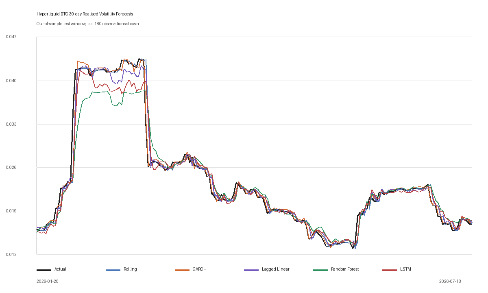

# 比特币波动率预测中的准确性、可解释性与实用性：机器学习模型与统计模型的比较

## 摘要

本项目研究在预测比特币波动率时，机器学习模型所增加的复杂性是否合理。项目使用 Hyperliquid 比特币永续期货日度数据评估五种模型：滚动历史波动率、GARCH(1,1)、滞后线性回归、随机森林和长短期记忆（LSTM）网络。预测目标是下一日更新后的对数收益率标准差，主要采用 30 日窗口计算。主要测试采用固定的时间顺序截点，同时以 14 日目标、四个扩展窗口折、两个测试期分段、波动率状态、移动区块自助法以及随后七日的数据刷新提供稳健性证据。在考察准确性的同时，也考察可解释性、实测本地运行时间、结构复杂性和可复现性。

GARCH(1,1) 取得最低的主要 RMSE，`0.00098502`，比滚动历史波动率低 30.994%。它在 14 日目标、测试期的前后两半、所有扩展窗口折以及全部三个目标波动率状态中也均排名第一。相对于滚动模型，其 RMSE 差值的配对移动区块自助法区间为 `[-0.00099670, -0.00017158]`。随机森林整体上不及滚动模型；LSTM 在第一个和第四个扩展窗口折中具有局部竞争力，但未能形成稳定的总体改进。结论被刻意限定在特定范围内：在这一数据集、目标和实现下，机器学习所增加的复杂性并未带来足够明确且稳健的准确性增益，因此不具备合理性。

## 1. 引言

波动率描述的是收益率变化的幅度，而不是价格变动的方向。价格方向预测询问比特币将上涨还是下跌；波动率预测则询问下一时期可能有多大的不确定性或变动性。即使交易者和风险管理者不知道下一期收益率的正负号，也可以在设定头寸规模、风险限额或抵押品缓冲时使用这样的估计。加密货币适合用于这项研究，因为剧烈波动和持续的市场压力使不断变化的不确定性清晰可见，而公开的交易所数据使独立复现这一比较成为可能。

本项目提出的问题是：

> 在预测比特币波动率时，就准确性、可解释性、计算实用性和稳健性而言，随机森林和长短期记忆网络与滚动历史波动率及 GARCH(1,1) 相比表现如何？

这一表述旨在比较，而不是宣传。机器学习能够表示非线性关系和复杂序列，但灵活性并不会自动带来效用。它可能增加过拟合风险、需要更多选择，并使预测更难解释。统计模型的灵活性可能较低，但波动率的持续性为其提供了可利用的强结构。因此，本项目采用严格的决策规则：不能仅仅因为一种更复杂的方法在一次测试中排名略高就优先选择它。它应当在主要误差上取得实质性降低，在不同时间顺序检验中保持这一优势，并提供足够的实用或解释性收益，以证明其额外结构的合理性。

本研究根据交易所蜡烛图构建明确的目标，拟合两种机器学习方法和透明的统计替代方法，并在不进行随机打乱的情况下评估较晚的观测值。滞后线性回归是辅助比较模型：它不是研究问题中点名的四种模型之一，但可以检验工程化特征中是否包含无须非线性学习器也能利用的信息。这里的资产特指 Hyperliquid 比特币永续期货，而不是一般性的比特币现货指数。这提高了数据来源的明确性，但限制了结果向其他交易所和现货市场的推广。

评估日期是固定的，而不是每次下载后重新计算为移动的 80/20 边界。每当追加新的完整蜡烛图时，2025 年十一月 16 日始终是主要测试中的第一个预测起点日期。这一点很重要，因为否则刷新数据会将若干观测值从测试集移入训练集，同时改变证据和研究问题。因此，将最终代码分别应用于 2026 年七月 14 日和 20 日可获得的数据，可以在相同历史截点下检验新完成的七日数据是否改变结果。

本项目还将实现审计视为证据。预测日期、GARCH 递推、滚动目标转换、未完成蜡烛图、特征重复以及缩放边界均经过明确检查。最终结论基于审计后的流程，而不是仅仅为了与早期草稿保持一致而保留。

## 2. 文献综述

### 2.1 为什么 GARCH 仍是不可轻视的基准模型

金融收益率方差通常不会随时间保持恒定。大幅波动往往聚集出现，平静时期亦然。Bollerslev（1986）提出了广义自回归条件异方差模型，使条件方差可以取决于近期冲击的平方和先前的条件方差。因此，GARCH(1,1) 是围绕持续性设计的，而不是套用于时间序列的一般回归。

Hansen 和 Lunde（2005）的研究说明了为什么不应将 GARCH(1,1) 视为一个弱基准。他们对 330 种 ARCH 类模型进行了样本外比较。对于汇率数据，他们没有发现更复杂模型优于 GARCH(1,1) 的证据，尽管非对称模型在 IBM 收益率上表现更好。其启示是有条件的：GARCH 在一种情境中可能很难被超越，而在另一种情境中却可能不够充分。Katsiampa（2017）也支持对比特币采用条件方差建模；在其样本内测试的若干 GARCH 族设定中，带自回归成分的 GARCH 模型表现最强。两项研究都没有证明简单 GARCH 必然会赢得本次实验；二者共同说明，将其视为有力竞争者是合理的。

### 2.2 关于机器学习的混合证据

机器学习文献并未给出一种稳定的排名。Dudek 等人（2024）在四种加密货币上比较了 12 种统计和机器学习方法，包括 GARCH、随机森林和 LSTM。模型表现因资产、损失函数和预测期限而异，简单的线性方法也可能与更复杂的学习器相当。然而，他们的已实现方差由日内收益率构建，信息比本研究使用的日度滚动代理指标更丰富。

Huang、Sangiorgi 和 Urquhart（2024）给出了相反的结果。他们使用 2014 至 2021 年的高频比特币数据，报告神经网络在所测试的各个期限上均优于 GARCH。他们的 LSTM 和 CNN-LSTM 模型获得了更丰富的数据变换和更多日内观测值，因此小型日度数据 LSTM 并不是等价的复现实验。Shen、Wan 和 Leatham（2021）也发现循环网络按平均预测评价指标衡量时表现更好，但对极端事件和风险价值的效果较弱。这一区别支持评估高波动率时期的表现，而不是只依赖总体 RMSE。

混合模型研究削弱了统计方法与机器学习方法彼此对立的观点。Zahid、Iqbal 和 Koutmos（2022）将 GARCH 结构与机器学习相结合，用于预测比特币已实现波动率。混合模型是合理的扩展方向，但如果在确立各自独立基准之前就实施混合模型，将更难识别改进的来源。Catania、Grassi 和 Ravazzolo（2019）进一步表明，加密货币的可预测性会受到模型和参数不稳定性的影响。本项目采用固定的时间顺序留出集、两个时间分段和四个扩展窗口区块来应对这一问题。这些检验比单次划分更有力，但它们仍来自同一段市场历史，而不是相互独立的外部样本。

### 2.3 特征、序列与可解释性

Breiman（2001）将随机森林描述为随机化决策树的集成。自助抽样和随机特征选择降低树与树之间的依赖，而平均则降低方差。该方法能够捕捉阈值和交互作用，无须假设线性方程。然而，在时间序列研究中，它不会自动知晓时间顺序；过去的信息必须通过滞后项和滚动特征来表示。因此，特征设计是模型的一部分，而不是中性的预处理。

Hochreiter 和 Schmidhuber（1997）提出 LSTM，以解决循环神经网络在学习较长依赖关系时面临的困难。其门控机制控制哪些信息被保留、更新和输出。这种架构看似适合具有持续性的波动率，但适用性并不等于准确性的证明。序列长度、隐藏层大小、缩放、学习率、正则化和停止条件都很重要，特别是在只有约一千个训练观测值的情况下。

可解释性也必须谨慎定义。Lundberg 和 Lee（2017）展示了归因方法如何解释复杂预测的部分内容，而 Molnar（2025）强调，不同解释工具回答的是不同问题。本项目并不声称对 LSTM 进行了完整的局部解释。它只记录实际产生的证据：GARCH 的方程和参数、线性模型带符号的标准化系数、随机森林的不纯度与置换重要性及袋外诊断，以及 LSTM 的架构、损失和种子稳定性。特征重要性仍然只反映关联，可能被分摊到相关输入之间，并且无法解释单次预测的方向。

### 2.4 波动率通过代理指标衡量

真实条件波动率是潜在变量。Patton（2011）表明，模型排名可能取决于用于比较预测的代理指标和损失函数。高频已实现方差通常比基于单个日收盘价的滚动标准差包含更多信息。因此，本研究的目标被描述为*日度已实现波动率代理指标*，而不是比特币的真实波动率。

该代理指标具有一项重要的结构特征：明日主要窗口中的 30 个收益率，有 29 个在今日已经知晓。因此，持续性既有数学成因，也有实证成因。滚动波动率是一个要求很高的操作性基准，模型要超越它，就必须更准确地估计进入窗口的收益率和离开窗口的收益率所产生的影响。这一设计适合预测更新后的单日提前风险指标，但不同于预测一个完全位于未来且不与当前窗口重叠的 30 日窗口。

总的来说，文献支持开展这一比较，但并未预先决定其答案。GARCH 具有坚实的理论和实证基础；借助更丰富的数据和设计，机器学习可以超越它；简单方法仍可能具有竞争力；而排名取决于市场、目标和评估程序。本研究通过一个小型、可审计的日度数据实验回答这一有条件的问题。

由此得出三项预期，但没有任何一项被视为必然结果。由于目标重叠，滚动波动率应当很难被超越。如果条件冲击信息能够改善对进入窗口的一个未知收益率的估计，GARCH 应当受益。只有当非线性特征交互或序列模式包含超越这种持续性的信息时，随机森林和 LSTM 才应当受益。这种表述避免在事后声称，无论哪个模型获胜，它都在理论上注定如此。

## 3. 数学表述

设 $P_t$ 为第 $t$ 日的每日收盘价。对数收益率为

\[
r_t=\ln\left(\frac{P_t}{P_{t-1}}\right).
\]

对于 $n$ 日窗口，日度已实现波动率代理指标是样本标准差

\[
RV_t^{(n)}=\sqrt{\frac{1}{n-1}\sum_{i=t-n+1}^{t}(r_i-\bar r_t)^2}.
\]

主要窗口为 $n=30$，而 $n=14$ 用作稳健性检验。数值不进行年化。一条在第 $t$ 日形成的数据行预测

\[
y_t=RV_{t+1}^{(n)},
\]

滚动历史波动率则设定 $\hat y_t=RV_t^{(n)}$。

特征缩放仅在相应的训练部分上进行拟合：

\[
z_{tj}=\frac{x_{tj}-\mu_{j,\mathrm{train}}}{\sigma_{j,\mathrm{train}}}.
\]

随后，滞后线性模型求解带轻微正则化的目标函数，

\[
\hat\beta=\arg\min_\beta\sum_{t\in\mathrm{train}}(y_t-z_t^\top\beta)^2+\lambda\lVert\beta\rVert_2^2,
\]

其中，$\lambda=10^{-8}$ 用于提升数值稳定性，而不是进行强收缩。随机森林对 $B$ 棵已拟合的树取平均，

\[
\hat y_t^{RF}=\frac{1}{B}\sum_{b=1}^{B}T_b(z_t).
\]

对于 LSTM，输入和前一隐藏状态决定诸如 $f_t=\sigma(W_f[x_t,h_{t-1}]+b_f)$ 的门；单元状态通过 $c_t=f_t\odot c_{t-1}+i_t\odot\tilde c_t$ 更新，最终隐藏表示被映射为一个波动率估计值。这些方程描述信息流，而不是对每个学习权重的直接经济解释。

GARCH(1,1) 将单步条件方差建模为

\[
h_{t+1}=\omega+\alpha\epsilon_t^2+\beta h_t.
\]

这里，$\alpha$ 衡量冲击响应，$\beta$ 衡量持续性。最终估计值为 $\alpha=0.10$、$\beta=0.78$，且 $\alpha+\beta=0.88$。网格搜索选择 $\alpha$ 和 $\beta$；方差目标法意味着 $\omega=(1-\alpha-\beta)\hat\sigma_r^2$，因此报告的三个参数并不是三个相互独立搜索的量。

为了将条件方差映射到滚动目标，设 $S_t$ 和 $Q_t$ 分别为已知的前 $n-1$ 个收益率之和及平方和。在条件均值为零的情况下，

\[
E[s_{t+1}^2\mid\mathcal F_t]=\frac{Q_t+h_{t+1}-(S_t^2+h_{t+1})/n}{n-1}.
\]

因为目标是标准差，而且评估采用平方误差，所以主要实现以确定性的 80 点高斯–埃尔米特求积估计 $E[s\mid\mathcal F_t]$。解析式 $\sqrt{E[s^2\mid\mathcal F_t]}$ 被保留为敏感性检验，因为当平方根为凹函数时，两个表达式并不相同。

对于 $m$ 个测试观测值，

\[
MAE=\frac1m\sum_{t=1}^{m}|y_t-\hat y_t|,
\qquad
RMSE=\sqrt{\frac1m\sum_{t=1}^{m}(y_t-\hat y_t)^2}.
\]

RMSE 对较大的预测偏差赋予更大权重；MAE 表示典型的绝对偏差。第 $b$ 个自助法重复样本使用下式将每个模型与滚动模型比较：

\[
\Delta_b=RMSE_b(M)-RMSE_b(\mathrm{Rolling}),
\]

因此，负值表示竞争模型更优。

## 4. 方法论

### 4.1 数据收集、质量与刷新控制

日度 OHLCV 蜡烛图由 Hyperliquid 的公开 `candleSnapshot` 端点提供（Hyperliquid，2026）。在返回的 1,241 行中，依据结束时间戳剔除了仍未收盘的一根蜡烛图。最终纳入的归档数据包含 1,240 根完整蜡烛图，时间跨度为 2023 年二月 26 日至 2026 年七月 19 日（`2026-07-19`）。

质量门控检查数据结构、时间戳顺序和唯一性、日度间隔、交易品种、时间周期、价格为正、OHLC 排序以及交易活动指标非负。未发现任何严重问题；所有观察到的起始时间间隔均为 86,400,000 毫秒。原始蜡烛图、处理后的波动率和质量报告分别存储。永续期货并不等同于现货 BTC-USD，因此结论仍然具有特定市场局限性。

对于日度目标，蜡烛图完成判定规则尤为重要。一个尚未完全形成的收盘价会同时改变最新收益率、滚动波动率、成交量和交易笔数，使最后一行无法与此前每根完整蜡烛图相比较。

2025 年十一月 16 日这一截点由原始时间顺序划分得出，之后即予以固定。新蜡烛图会延长测试集结束日期，而不会移动其起始日期或成为训练行。为了使用同一代码进行比较，最终流程分别在截至七月 12 日的数据切片和截至七月 19 日的当前输入上运行。追加的七日数据在同一段市场历史中提供了一次类似前瞻式的稳定性检验。

### 4.2 特征构建与泄漏控制

收益率、活动变量、滞后项和滚动指标只使用在预测起点 $t$ 时已观测到的信息；目标随后被移至 $t+1$。导出的数据同时保留起点 `date` 和预测的 `target_date`。在按时间顺序划分之前，移除预热阶段的缺失行。

`realised_volatility_30d` 和 `rolling_return_std_30d` 在浮点精度范围内是相同的数学特征。同时保留二者会重复计算持续性、分散重要性，并增加某一特征在树中被选中的概率。因此，匹配的滚动标准差列被排除，最终保留 25 个表格输入和八个 LSTM 输入。

最终的 30 日数据框包含 1,195 行，日期从 2023 年四月 11 日到 2026 年七月 18 日。固定训练部分包含 950 个预测起点行，截止于 2025 年十一月 15 日；测试集包含 245 个起点，日期从 2025 年十一月 16 日到 2026 年七月 18 日，目标日期则持续到七月 19 日。没有使用随机训练—测试打乱。表格数据缩放仅在训练集上拟合。LSTM 缩放在其按时间顺序划分的内部验证区块之前拟合，因此验证集和测试集分布不会影响缩放参数。

即便截点相同，不同模型的有效训练样本数也不同。线性回归和随机森林使用 950 个带标签的数据行。LSTM 使用 921 个按时间顺序排列的序列，其中 783 个是拟合序列，138 个是内部验证序列。GARCH 使用 993 个截点前收益率估计其收益率过程，其中包括无法形成完整特征行的预热历史。滚动模型没有拟合样本。报告这些样本数，可以避免暗示结构不同的模型使用完全相同的观测值。

因此，共同的公平性约束是信息时间，而不是人为要求行数相等：每个拟合量都在同一截点前结束，每次预测都只使用在其起点时可获得的信息。这种有效样本数不等的情况被保留下来，既作为一项局限，也作为每种架构如何利用历史的证据，而不是被主要数据框的规模所掩盖。

GARCH 使用额外的预热收益率来估计收益率过程，而不是带标签的滚动波动率目标；LSTM 则因构建序列而舍弃早期标签。记录这些差异比把 950 报告成所有模型完全相同的训练样本数更有信息价值。

### 4.3 模型

**滚动历史波动率。** 该基准模型将今日的滚动代理指标向前延续一天。它没有拟合参数，并直接利用相邻窗口之间的重叠。

**GARCH(1,1)。** 确定性的、由粗到细的高斯最大似然网格搜索与方差目标法相结合。似然函数对 $r_t$ 的评分先使用 $h_t$，再由 $r_t^2$ 更新 $h_{t+1}$，从而避免当前冲击进入其自身方差。参数在主要测试期间保持固定，但每当新的收益率变为可观测时，条件方差就会更新。预测按日期对齐，映射缺失或重复都会导致流程失败。

**滞后线性回归。** 使用岭参数 $10^{-8}$ 在标准化输入上拟合线性方程。每个系数均被导出。系数描述标准化尺度上的关联；相互相关的滞后指标仍然使因果解释不成立。

**随机森林。** 项目内实现的回归器使用 160 棵自助抽样树，最大深度为 7，最小叶节点大小为 10，并在每次分裂时使用约为可用特征数平方根的特征数量。种子 42 使森林可复现。候选阈值为特征分位数，因此该实现比优化后的库实现更轻量。不纯度重要性和十次重复的置换重要性均被导出。置换重要性在对留出集完成预测后计算，只用于解释已经完成的模型，而不用于选择特征或重新调参。

**LSTM。** 长度为三十个观测值的序列输入一个具有 32 个隐藏单元的 LSTM 层，之后连接一个 16 单元的 ReLU 层和一个输出。Adam 的学习率为 `0.003`，权重衰减为 `1e-5`，批量大小为 32。训练序列的最后 15% 构成按时间顺序排列的验证区块，用于提前停止。最终测试集不决定停止轮次。主要网络完成 50 个轮次，选择第 20 个轮次，并包含 5,921 个可训练参数。种子 7、42 和 101 用于检验优化敏感性。

### 4.4 评估与决策规则

主要结果来自固定截点的时间顺序留出集。模型参数和权重不会在每个测试日重新拟合，但每种方法都会接收在该预测起点时可获得的信息。补充的扩展窗口设计将测试期划分为四个有序区块。第一个区块采用主要训练边界；之后每一折都把测试集中更早的观测值加入训练集，重新拟合每个需要拟合的模型，并重新计算缩放。这是区块级重新拟合，而不是每日在线学习。

稳健性检验还包括 14 日和 30 日目标、按时间顺序划分的测试期前后两半，以及根据已实现测试目标定义的低、中、高波动率三分位状态。这些状态是事后诊断分组，而不是实时分类。配对循环移动区块自助法以 30 日为区块长度重采样 2,000 次。三十日与主要目标的重叠长度一致，有助于保留局部依赖关系（Künsch，1989）。百分位区间描述这一重采样设计下的不确定性；它们并不是普适的显著性保证。

本研究通过证据而不是任意加权得分来回答研究问题：

| 维度 | 使用的证据 | 决策规则 |
| --- | --- | --- |
| 准确性 | MAE、MSE 和 RMSE | RMSE 决定显示的排名；必须讨论 MAE 不一致之处 |
| 稳健性 | 目标窗口、前后两半、折、状态、刷新和自助法 | 所声称的优势不应依赖于一个边界或少量日期 |
| 可解释性 | 公式、参数、系数、重要性或记录的架构 | 只认可流程实际产生的解释 |
| 实用性 | 拟合/预测时间、依赖项和结构规模 | 计时是本地实现证据，而非普适速度结论 |
| 可复现性 | 固定日期、种子、配置、元数据和测试 | 另一次运行应能复现该设计，并解释任何由数据驱动的变化 |

只有当复杂模型的增益足够大且足够稳定，能够补偿其较弱的透明度或更高的实现负担时，它才具有合理性。

## 5. 结果

### 5.1 主要 30 日目标

| 排名 | 模型 | MAE | MSE | RMSE | 相对于滚动基准的 RMSE |
| ---: | --- | ---: | ---: | ---: | ---: |
| 1 | GARCH(1,1) | 0.00047642 | 0.00000097 | 0.00098502 | -30.994% |
| 2 | 滞后线性回归 | 0.00073861 | 0.00000196 | 0.00140087 | -1.861% |
| 3 | 滚动历史波动率 | 0.00062843 | 0.00000204 | 0.00142744 | 0.000% |
| 4 | LSTM | 0.00104907 | 0.00000304 | 0.00174351 | +22.142% |
| 5 | 随机森林 | 0.00135845 | 0.00000540 | 0.00232370 | +62.787% |

GARCH 的 MAE 和 RMSE 最低。其相对于滚动基准的 RMSE 差值为 `-0.00044242`，相当于降低 30.994%：以日波动率百分点计，RMSE 约为 0.0985，而非 0.1427。

线性回归按 RMSE 排名第二，但其 MAE 高于滚动基准，因此这一小幅优势需要不确定性证据。LSTM 和随机森林的 RMSE 分别比滚动基准高 `+0.00031607` 和 `+0.00089625`。

去重后，两种森林重要性方法都依次将当前 30 日波动率、其一日滞后值、30 日平均绝对收益率以及当前波动率的两日滞后值排在最高位置。这些是关联而非因果；森林在很大程度上是在重构由更简单模型以更简洁方式表达的持续性。

*图 1. 所展示测试区间内的实际下一日滚动波动率代理值与预测值。底层 CSV 保留每个测试观测值；为确保可读性，图表限制了可见时段。*

在持续性较强的时段，所有预测都能紧密跟踪目标，而波动率水平的变化会造成最大差异。因此，必须结合波动率状态和自助法证据来解读该图，而不能让平静时期或某一次显眼的预测失误决定排名。

这也说明了为什么仅靠目视检查并不充分：数条彩色路径在很长的区间内相互重合，但在数量相对较少的剧烈转折处，其误差对 RMSE 的贡献不成比例。MAE、不同波动率状态下的偏差以及重采样差值揭示了压缩图可能掩盖的方面。

### 5.2 目标、时间及不确定性方面的稳健性

| 目标窗口 | GARCH RMSE | 线性回归 RMSE | 滚动基准 RMSE | LSTM RMSE | 随机森林 RMSE |
| ---: | ---: | ---: | ---: | ---: | ---: |
| 14 日 | 0.00178208 | 0.00260295 | 0.00276213 | 0.00364246 | 0.00405515 |
| 30 日 | 0.00098502 | 0.00140087 | 0.00142744 | 0.00174351 | 0.00232370 |

GARCH 在 14 日目标中排名第一，比滚动基准低 35.482%。这一较短窗口下，每个模型的误差都更大，因为每个新进入或离开窗口的收益率都有更大影响。GARCH 在两个测试半段中也都排名第一，RMSE 分别为 `0.00128466` 和 `0.00054380`。

| 模型 | 相对于滚动基准的 RMSE 差值点估计 | 30 日区块自助法区间 | 偏向该模型的重采样占比 |
| --- | ---: | ---: | ---: |
| GARCH(1,1) | -0.00044242 | [-0.00099670, -0.00017158] | 100.00% |
| 滞后线性回归 | -0.00002657 | [-0.00009605, 0.00003681] | 80.45% |
| LSTM | +0.00031607 | [0.00000898, 0.00063980] | 2.00% |
| 随机森林 | +0.00089625 | [0.00008895, 0.00158205] | 0.10% |

GARCH 的区间始终低于零；线性回归的区间跨过零。两个机器学习模型的区间均始终高于零：只有 2.00% 的重采样偏向 LSTM，0.10% 偏向随机森林。这支持其总体表现不佳的结论，而非由少数孤立的预测失误所致，尽管对单段历史进行重采样并不会产生独立的市场。

### 5.3 滚动预测起点、波动率状态与诊断

对于 GARCH、线性回归、滚动基准、LSTM 和随机森林，拼接各折后的 RMSE 分别为 `0.00098681`、`0.00139934`、`0.00142744`、`0.00203235` 和 `0.00228159`。GARCH 在每一折中都排名第一，尽管随着难度变化，其 RMSE 在 `0.00040604` 至 `0.00172036` 之间波动。

LSTM 在局部具有竞争力：它在第 1 折和第 4 折中排名第三，两折的 RMSE 均为 `0.00082578`，略低于滚动基准和随机森林，但并未低于线性回归。它在第 2 折和第 3 折中降至第四，因此这些局部优势不足以证明总体稳定性。

GARCH 在低、中、高波动率状态下的 RMSE 分别为 `0.00065099`、`0.00058047` 和 `0.00146368`。其高波动率状态偏差为 `-0.00015218`，表明在风险最重要时，其预测平均略有低估。

随机森林在全部 950 个训练行上的 OOB RMSE 为 `0.00131585`，而按时间顺序测试的 RMSE 为 `0.00232370`，差距为 `0.00100785`。OOB 树可以使用训练期中较晚的行进行训练，因此，该指标诊断的是内部预测能力，而非时间序列验证表现，并揭示出较弱的跨时期泛化能力。

随机种子 7、42 和 101 对应的 LSTM RMSE 分别为 `0.00184673`、`0.00174351` 和 `0.00183721`，选定的训练轮数分别为 11、20 和 16。`0.00010322` 的极差显示了优化差异，但每次运行仍高于滚动基准的 `0.00142744`。

### 5.4 七日刷新稳定性

后一次刷新追加了完整蜡烛图，同时保留 2025 年十一月 16 日这一边界，从而在不重新分配先前测试观测值的情况下检验稳定性。

| 模型 | 使用截至七月 12 日数据的 RMSE | 使用截至七月 19 日数据的 RMSE | 排名变化 |
| --- | ---: | ---: | ---: |
| GARCH(1,1) | 0.00099309 | 0.00098502 | 1 → 1 |
| 滞后线性回归 | 0.00141843 | 0.00140087 | 2 → 2 |
| 滚动历史波动率 | 0.00144481 | 0.00142744 | 3 → 3 |
| LSTM | 0.00176625 | 0.00174351 | 4 → 4 |
| 随机森林 | 0.00235585 | 0.00232370 | 5 → 5 |

新增一周使每个模型的 RMSE 均下降约 0.8–1.4%，但所有排名均保持不变。这是一项程序性稳定性检查，而不是独立重复研究。

### 5.5 GARCH 转换敏感性

| 条件方差转换方式 | MAE | RMSE |
| --- | ---: | ---: |
| $E[s\mid\mathcal F_t]$，80 点高斯–埃尔米特求积 | 0.00047642 | 0.00098502 |
| $\sqrt{E[s^2\mid\mathcal F_t]}$，解析法敏感性检验 | 0.00048149 | 0.00098447 |

解析法敏感性检验的平均预测值高出 `0.00000950`，而 RMSE 仅低 `0.00000055`。在两种方法下，GARCH 均保持第一。数值求积仍作为主要方法，因为它估计的是被评估标准差目标的条件均值。

### 5.6 实用性与可解释性

| 模型 | 拟合时间 | 预测时间 | 结构证据 | 解释证据 |
| --- | ---: | ---: | --- | --- |
| 滚动基准 | 0.000000 s | 0.000016 s | 0 个拟合参数 | 直接的持续性规则 |
| 线性回归 | 0.000236 s | 0.000037 s | 26 个系数（包括截距） | 导出的带符号系数，并注明共线性局限 |
| GARCH(1,1) | 1.001552 s | 0.020569 s | 3 个报告参数 | 基线方差、冲击响应和持续性 |
| LSTM | 5.422232 s | 0.010940 s | 5,921 个可训练参数 | 架构、损失历史和多随机种子证据 |
| 随机森林 | 5.412435 s | 0.038393 s | 17,984 个树节点 | 不纯度/置换重要性和 OOB 诊断 |

GARCH 的拟合约耗时一秒，并以三个报告参数实现了最低误差。每个机器学习模型的拟合约耗时 5.4 秒，增加了结构和调优选择，却未带来总体收益。这些本地运行且优化程度不一的实现只能支持项目层面的决策；参数、权重和树节点并非可互换的复杂度单位。

## 6. 讨论

这些证据从四个维度回答了研究问题，而不是依赖单一分数。GARCH 的 MAE 和 RMSE 均排名第一，在两个目标窗口、两个测试半段、每个扩展窗口折和每个波动率状态中都保持第一，而且其方差动态比机器学习模型更容易直接检视。滚动基准是最简单的方法，同时仍是一个要求严苛的参照。线性回归透明且快速，但其 1.861% 的 RMSE 改善伴随着更差的 MAE 和跨过零的自助法区间。随机森林和 LSTM 并未产生足够稳定的总体收益，因而不足以补偿它们额外的选择和较弱的预测层面解释。

本文没有为透明度或速度赋予任意数值权重。相反，准确性用于确定某个候选模型是否值得考虑，稳健性用于检验这种收益是否持续，而可解释性和实用性则用于判断额外复杂性是否有合理依据。这可防止某一局部胜出的折或微小的计时差异主导整体评价。

GARCH 的表现具有理论合理性。条件方差对最近的平方冲击作出响应，同时通过 $\beta$ 保留早期方差。其持续性为 `0.88`，表明其具有显著记忆性，同时仍低于平稳性边界。滚动目标转换也为 GARCH 提供了一项相关任务：下一个 30 日窗口中的 29 个收益率是已知的，而对新进入窗口的收益率之不确定性则由 $h_{t+1}$ 提供。滚动基准假设新进入的观测不会产生可预测的更新；GARCH 用估计的方差贡献取代了这一假设。

高斯–埃尔米特检验为这一解释增添了限定条件。主要的期望标准差预测在代数上并不等同于期望方差的平方根。两者的平均预测值仅相差 `0.00000950`，RMSE 仅相差 `0.00000055`，而无论采用哪种转换，GARCH 均保持第一。这比忽视这一区别，或围绕一个在数值上微不足道的敏感性结果重建主要论点，都更有说服力。

滚动基准的强势表现部分源于目标本身的构造。明日窗口与今日窗口高度重叠，因此持续性既是目标构造的数学结果，也是一种市场模式。这使滚动基准对于单日操作更新而言是公平的，但对于完全属于未来且不重叠的预测期限，它可能低估更丰富模型的价值。这也解释了为什么很小的 RMSE 优势不应自动被称为具有实际重要性。

线性回归说明了排名与有意义改善之间的区别。其 RMSE 比滚动基准低 1.861%，但其 MAE 更高，而且自助法区间跨过零。因此，称其明确更优会夸大证据。移除完全重复的滚动标准差特征后，系数证据的误导性有所降低，但其余的滞后变量和窗口变量仍相互关联。系数符号反映的是可审计的关联，而非独立的因果效应。

机器学习模型的失败和局部成功都具有信息价值。随机森林的主导特征表明，其集成结构的大部分作用是在重新发现持续性。OOB 与未来测试之间的差距表明，可在训练期内迁移的关系并不能同样良好地跨市场时期迁移。不纯度重要性和置换重要性都不能解释单次预测，而在留出集上进行置换是刻意安排的事后分析，并非另一个调优阶段。

LSTM 的情况更为复杂。它在扩展窗口的第 1 折和第 4 折中排名第三，并略微优于滚动基准和随机森林，说明该架构能够提取有用的序列信息。它在这两折中均未优于线性回归，而其总体 RMSE、高波动率表现、其他折结果和随机种子范围表明，这种局部优势在此并不足够可靠。这使当前发现与偏好神经网络的高频研究相协调：正确结论并非 LSTM 从来无效，而是该日频样本和紧凑架构未能提供稳健收益。

从风险管理角度来看，GARCH 是所测试模型中最站得住脚的选择，因为它结合了相对于滚动基准 30.994% 的 RMSE 降幅、稳定的第一名排名，以及简洁的解释：近期冲击和持续的条件方差会更新明日的风险代理值。其高波动率状态偏差 `-0.00015218` 仍然重要。总体上的优越性并不保证在压力时期给出保守预测。滚动基准仍是最容易实施的后备方案。机器学习只有通过更丰富的数据、调优或不同预测期限取得稳定收益，才能证明额外建模选择的合理性。

固定截点刷新可防止结果漂移：重新计算 80/20 切分会同时改变数据和实验。冻结起始点可使新增的七日数据延长既定留出集。所有排名保持不变，每个模型的 RMSE 均略有下降，因此核心结论经受住了这项短期检查。

开发审计既增强了项目，也揭示了时间序列证据的脆弱性。较早的 GARCH 结果曾在特征工程删除若干行后，依据重置过的数据框索引选择预测值；日期映射纠正了对齐。似然计算也曾在对当前收益率评分之前，先用其平方更新方差；颠倒顺序消除了前视。期望样本方差也已修正，使不确定的下一期收益率同时影响其平方值和随机样本均值。后续检查排除了尚未收盘的蜡烛图，分离预测日期与目标日期，移除了一个完全重复的特征，冻结了评估截点，并衡量了标准差转换近似。如今有三十九项自动化测试保护着主要日期、公式、诊断和导出结果。

仍存在六项局限。第一，本研究仅使用一种资产和一家交易所。第二，目标是日频滚动代理值，而非高频已实现方差。第三，所有折、波动率状态和刷新都属于同一段市场历史。第四，尽管加密货币收益率具有厚尾特征，GARCH 仍使用高斯似然。第五，随机森林和 LSTM 的调优被有意限制，且未嵌套在独立的按时间顺序搜索中。最后，没有通过投资组合、交易成本或风险价值分析将预测差异转化为金融结果。本项目可以评价预测误差和实用性，但并未证明盈利能力或资本充足性。

更有力的扩展方案应预留另一个未曾使用的未来时期，使用日内收益率构建已实现方差，检验 Student-t 或非对称 GARCH，并在嵌套的按时间顺序验证中调优机器学习模型。混合模型可以将 GARCH 方差作为非线性模型的输入。情绪是另一个可能增加的因素：Brauneis 和 Sahiner（2026）发现了非线性情绪效应，尽管结果因币种而异，而比特币是一个重要例外。各项扩展应分别引入，以便任何改善的来源仍可识别。

## 7. 结论

本项目探究的问题是：当以准确性、可解释性、计算实用性和稳健性评价比特币波动率预测时，随机森林和 LSTM 是否优于滚动历史波动率与 GARCH(1,1)。在所测试的 Hyperliquid 日频数据设计下，GARCH 实现了最佳平衡。其主要 RMSE 为 `0.00098502`，相对于滚动基准改善 30.994%，并在两个目标窗口、两个测试半段、全部四个扩展窗口折和全部三个波动率状态中均排名第一。固定截点刷新和目标转换敏感性均未改变这一结论。

线性回归仍与滚动基准接近，但由于 MAE 更差且自助法区间跨过零，其改善存在不确定性。LSTM 在有限情境下具有竞争力，但缺乏总体稳定性；而随机森林的未来测试误差和结构成本超过了其非线性灵活性所带来的价值。该结论的适用范围有限，而非意识形态式判断：GARCH *在本实验中* 表现最强。已发表研究表明，更丰富的高频数据和更先进的架构可能有利于机器学习模型。在本研究中，复杂性并未通过足够清晰、稳定且与情境相关的收益证明其价值。

## 参考文献

Bollerslev, T. (1986) ‘广义自回归条件异方差’，*计量经济学杂志*，31(3)，第 307–327 页。获取地址：https://doi.org/10.1016/0304-4076(86)90063-1.

Brauneis, A. 和 Sahiner, M. (2026) ‘加密货币波动率预测：HAR、情绪与机器学习竞赛’，*亚太金融市场*，33，第 379–411 页。获取地址：https://doi.org/10.1007/s10690-024-09510-6.

Breiman, L. (2001) ‘随机森林’，*机器学习*，45，第 5–32 页。获取地址：https://doi.org/10.1023/A:1010933404324.

Catania, L.、Grassi, S. 和 Ravazzolo, F. (2019) ‘模型与参数不稳定条件下的加密货币预测’，*国际预测杂志*，35(2)，第 485–501 页。获取地址：https://doi.org/10.1016/j.ijforecast.2018.09.005.

Dudek, G.、Fiszeder, P.、Kobus, P. 和 Orzeszko, W. (2024) ‘使用统计和机器学习方法预测加密货币波动率：一项比较研究’，*应用软计算*，151，111132。获取地址：https://doi.org/10.1016/j.asoc.2023.111132.

Hansen, P.R. 和 Lunde, A. (2005) ‘波动率模型预测比较：是否有任何模型能击败 GARCH(1,1)？’，*应用计量经济学杂志*，20(7)，第 873–889 页。获取地址：https://doi.org/10.1002/jae.800.

Hochreiter, S. 和 Schmidhuber, J. (1997) ‘长短期记忆’，*神经计算*，9(8)，第 1735–1780 页。获取地址：https://doi.org/10.1162/neco.1997.9.8.1735.

Huang, Z.-C.、Sangiorgi, I. 和 Urquhart, A. (2024) ‘使用机器学习技术预测比特币波动率’，*国际金融市场、机构与货币杂志*，97，102064。获取地址：https://doi.org/10.1016/j.intfin.2024.102064.

Hyperliquid (2026) ‘Info 端点’，*Hyperliquid 文档*。获取地址：https://hyperliquid.gitbook.io/hyperliquid-docs/for-developers/api/info-endpoint （访问日期：2026 年七月 20 日）。

Katsiampa, P. (2017) ‘比特币波动率估计：GARCH 模型的比较’，*经济学快报*，158，第 3–6 页。获取地址：https://doi.org/10.1016/j.econlet.2017.06.023.

Künsch, H.R. (1989) ‘一般平稳观测的刀切法与自助法’，*统计学年刊*，17(3)，第 1217–1241 页。获取地址：https://doi.org/10.1214/aos/1176347265.

Lundberg, S.M. 和 Lee, S.-I. (2017) ‘解释模型预测的统一方法’，*神经信息处理系统进展*，30。获取地址：https://arxiv.org/abs/1705.07874.

Molnar, C. (2025) *可解释机器学习：使黑箱模型可解释的指南*。第 3 版。获取地址：https://christophm.github.io/interpretable-ml-book/ （访问日期：2026 年七月 20 日）。

Patton, A.J. (2011) ‘使用不完善波动率代理值进行波动率预测比较’，*计量经济学杂志*，160(1)，第 246–256 页。获取地址：https://doi.org/10.1016/j.jeconom.2010.03.034.

Shen, Z.、Wan, Q. 和 Leatham, D.J. (2021) ‘比特币收益率波动预测：GARCH 与 RNN 的比较研究’，*风险与金融管理杂志*，14(7)，337。获取地址：https://doi.org/10.3390/jrfm14070337.

Zahid, M.、Iqbal, F. 和 Koutmos, D. (2022) ‘使用结合机器学习的混合 GARCH 模型预测比特币波动率’，*风险*，10(12)，237。获取地址：https://doi.org/10.3390/risks10120237.
